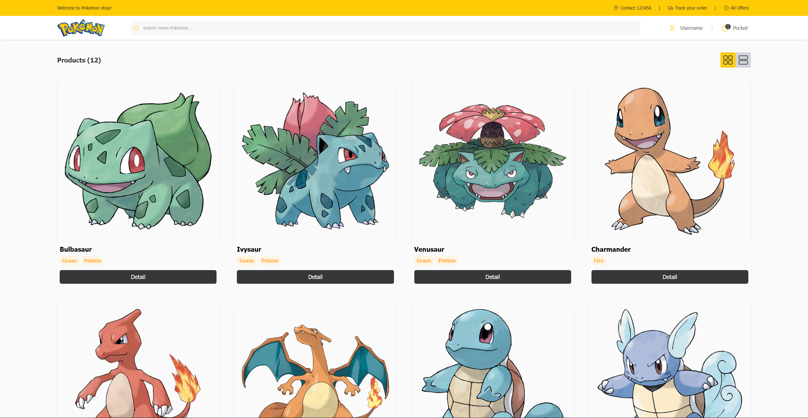

# Pokedex - Frontend Recruitment Test

## 📋 Project Overview

This project is a Pokedex application developed as a recruitment test for the Senior Frontend Developer position at **ChomCHOB**. The goal was to build a fully functional, pixel-perfect Pokedex application based on provided design specifications and technical requirements.

**🔗 [View Live Demo](https://chomchop-pokedex-web-app.vercel.app/)**

### 🔗 Reference Links

- **Live Demo:** [chomchop-pokedex-web-app.vercel.app](https://chomchop-pokedex-web-app.vercel.app/)
- **Test Requirements:** [ChomCHOB Frontend Testing - Senior](https://github.com/ChomCHOB/chomchob-frontend-testing/tree/main/senior)
- **Design Specification (Figma):** [Figma Design - Pokedex](https://www.figma.com/design/lOH3cDxir1RLdLsn4XzbpV/Quiz-for-Junior-Front-end?node-id=915-942&p=f)

---

## 📸 Preview



---

## 🚀 Features & Requirements

The application has been implemented to meet 100% of the specifications:

- **Pokemon List Page:**
  - Displays a grid of Pokemon.
  - Type-based filtering.
  - Infinite scroll or pagination (depending on implementation choice).
- **Pokemon Detail Page:**
  - Detailed stats, types, and abilities.
  - Visual representation of stats.
- **My Pocket (Collection System):**
  - Ability to "catch" and save Pokemon to a local pocket.
  - Manage and view collected Pokemon.
- **Pixel-Perfect UI:** Strictly follows the provided Figma design.
- **Responsive Web Design:** Fully optimized for Mobile, Tablet, and Desktop.

---

## 🛠️ Tech Stack

- **Framework:** [Next.js](https://nextjs.org/) (React)
- **Styling:** [Tailwind CSS](https://tailwindcss.com/)
- **State Management:** React Context API
- **API:** [PokeAPI](https://pokeapi.co/)
- **Icons & Fonts:** As specified in Figma.

---

## 🛠️ Installation & Getting Started

### Prerequisites

- Node.js (Latest LTS recommended)
- npm or yarn

### Setup

1. **Clone the repository:**
   ```bash
   git clone https://github.com/Ho-Sittichai/Pokedex.git
   ```
2. **Install dependencies:**
   ```bash
   npm install
   ```
3. **Run the development server:**
   ```bash
   npm run dev
   ```
4. **Open the application:**
   Navigate to [http://localhost:3000](http://localhost:3000)

---

## 👨‍💻 Statement of Completion

This project serves as a comprehensive demonstration of my frontend capabilities, including component architecture, state management, and the ability to translate complex designs into functional code. All features and conditions specified in the recruitment quiz have been fulfilled.

---

Developed with ❤️ by [Ho-Sittichai](https://github.com/Ho-Sittichai)
